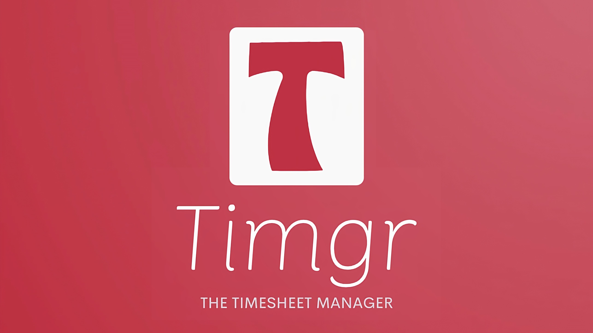

# Timgr - Public Release

## Overview
**Timgr** is a Python-based desktop application designed to streamline employee timesheet management for businesses of all sizes. By processing data from fingerprint identification systems, Timgr converts raw data into organized, readable, and information-rich reports. This transformation significantly reduces the time HR professionals spend on timesheet processing, allowing them to complete in minutes what once took hours.

## Key Features
- **Efficient Data Processing**: Quickly transforms raw data into refined timesheets, saving valuable HR time.
- **Enhanced Insights**: Provides detailed insights into employee shifts, with color-coded highlights for easy identification of leaves, absences, holidays, and discrepancies.
- **User-Friendly Interface**: Built using PySimpleGUI, Timgr offers an intuitive and easy-to-navigate user experience.
- **Focus on Strategic Initiatives**: By automating time-consuming tasks, Timgr enables HR teams to focus on strategic areas like talent management and organizational development.

## Installation
This repository is intended solely for uploading the setup file for Timgr. If you do not have the required password, please refrain from attempting to install the application.
